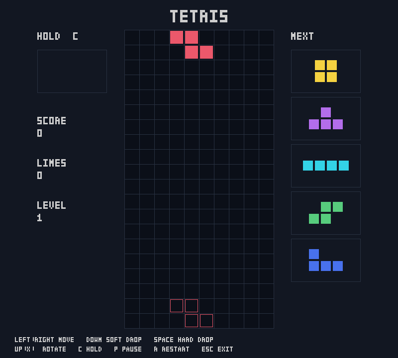

# Tetris — C / Apple Silicon

**Written from scratch in C. Targeted at Apple Silicon ARM64.**

A modular Tetris implementation in C17 and SDL2, with a standalone game engine,
SRS rotation, deterministic 7-bag randomization, and a fixed-step game loop.
Development phases 1–9 are complete, including gameplay, UI, and automated tests.



*16-second looping demo captured from the actual engine and SDL renderer using
scripted controls. See [how to reproduce the capture](assets/demo/README.md).*

## Features

- All seven tetrominoes, clockwise/counterclockwise SRS rotation, and wall kicks.
- 7-bag randomizer, five-piece NEXT queue, and HOLD once per piece before locking.
- Ghost landing preview, soft drop, and instant hard drop.
- Line-clear scoring, drop points, and increasing gravity every ten lines.
- Custom key repeat: 150 ms DAS and 40 ms ARR, independent of OS key repeat.
- 500 ms lock delay with up to 15 movement/rotation resets per piece.
- Pause, game over, and complete restart without recreating the window.
- Resizable 800 × 720 interface with piece colors, statistics, and control hints.

## Build and run

The primary target is macOS on Apple Silicon. Install the Xcode Command Line
Tools and SDL2 through Homebrew:

```sh
xcode-select --install
brew install sdl2
make
make run
```

The default build uses Clang, C17, `-arch arm64`, and debug symbols. Warnings
are treated as errors. SDL2 is located through `/opt/homebrew/bin/sdl2-config`,
then through `PATH`. Override discovery with `SDL_PREFIX=/custom/prefix` or
`SDL_CONFIG=/path/to/sdl2-config`.

```sh
make debug             # -O0 -g
make release           # -O2, separate build/release directory
make MODE=release run
make clean             # Remove generated build files
```

## Controls

- **Left / Right:** move; hold to repeat.
- **Down:** soft drop, normally 30 rows per second.
- **Space:** hard drop to the ghost position and lock immediately.
- **Up / X:** rotate clockwise.
- **Z:** rotate counterclockwise.
- **C:** hold or swap the active piece.
- **P:** pause or resume.
- **R:** restart while playing, paused, or after game over.
- **Esc:** quit. Closing the window also exits.

When both horizontal directions are held, the last pressed takes priority.
Losing focus releases held inputs but does not pause the game. Pausing freezes
gameplay timers and releases held inputs; press movement keys again after
resuming. Timing constants are defined in [game.h](include/game.h).

## Architecture

SDL2 handles the window, rendering, events, and platform timing. The engine
is plain C and can be compiled and tested without SDL2.

```text
                         main.c
             SDL lifecycle + frame accumulator
                            |
              +-------------+-------------+
              |             |             |
         input_process  game_update   renderer_draw
            input.c     fixed 60 Hz     renderer.c
              |             |             |
              +----> game.c <-------------+
                     Game state        read-only view
                         |
           +-------------+----------------+
           |             |                |
      board/piece   collision/rotation  randomizer/scoring
       bitmasks          SRS            7-bag, rules

Rendering: renderer.c → preview.c + ui.c → text.c
```

- **`game.c`:** owns the board, active piece, queue, hold slot, score, input
  state, and timers. Coordinates movement, locking, line clearing, and spawning.
- **`board.c` / `piece.c`:** store occupancy in 24 ten-bit rows and tetrominoes
  in 16-bit masks. A separate byte per board cell preserves the locked color.
- **`collision.c` / `rotation.c`:** validate occupied cells and apply SRS kicks,
  including a separate table for I. Failed rotations leave the piece unchanged.
- **`randomizer.c` / `scoring.c`:** implement reproducible piece generation,
  points, levels, and gravity independently of rendering.
- **`input.c`:** converts SDL events into engine commands and filters OS repeats.
- **`renderer.c`:** owns SDL resources and draws the board, ghost, and active
  piece. `preview.c` draws HOLD, NEXT, and statistics; `ui.c` draws the title,
  controls, and state panels. `text.c` supplies bitmap glyphs without font assets.

The loop processes input, advances the engine in 1/60-second steps, and renders.
An accumulator separates simulation time from display frequency; catch-up time
is capped at 0.25 seconds per frame. Rendering uses an 800 × 720 logical space,
which SDL scales to the window while preserving its aspect ratio.

The state machine has `PLAYING`, `PAUSED`, and `GAME_OVER`. Only `PLAYING`
advances gameplay. A blocked spawn ends the game; restarting initializes all
engine state with a new seed while keeping the SDL window and renderer alive.
There are no application-owned dynamic allocations in the gameplay loop.

See the [detailed architecture notes](docs/ARCHITECTURE.md) (Spanish).

## Algorithms and scoring

The board has **10 columns, 20 visible rows, and 4 hidden rows**. A full row is
identified by its lower ten bits. Clearing compacts surviving rows downward
along with their colors. Collision checks inspect occupied piece cells rather
than the entire 4 × 4 bounding box.

Rotation follows SRS with states `0`, `R`, `2`, and `L`. Each rotation tests
ordered kick offsets; O keeps its occupied cells unchanged. The 7-bag uses
Fisher–Yates, SplitMix64, and rejection sampling for bounded random values.
Each bag contains every tetromino exactly once.

The ghost is a read-only landing query. Hard drop reuses that result and the
normal lock/clear/spawn path, ensuring its landing matches the preview.

- **Single / double / triple / Tetris:** 100 / 300 / 500 / 800 points,
  multiplied by the level before the clear.
- **Soft drop:** 1 point per row traveled.
- **Hard drop:** 2 points per row traveled.
- **Level:** starts at 1 and increases every 10 cleared lines.
- **Gravity:** `max(1/60, 0.8^(level - 1))` seconds per row. Soft drop never
  slows down high-level gravity. Normal gravity and blocked moves earn no points.

T-spin, combo, back-to-back, and perfect-clear bonuses are not implemented.

## Testing

```sh
make test                  # Engine + SDL events + renderer + startup smoke test
make test-engine           # Pure C engine; SDL2 is not required
make test-sdl              # SDL integration using dummy video for rendering
make MODE=release test     # Full suite with -O2
make sanitize-engine       # Engine with AddressSanitizer and UBSan
make sanitize              # Full sanitizer suite; see platform limitation below
```

Tests cover board operations, all seven pieces, collisions, SRS, gravity,
DAS/ARR, locking, line clearing, 7-bag, NEXT, HOLD, ghost, drop scoring, levels,
pause, restart, and input events. Additional checks compare **1,024 boards**
with an independent cell model and exercise **12,180 collision/lock positions**.
Renderer tests inspect ghost and active-piece pixels, state overlays, resize
behavior, and resource cleanup. Assertions stay enabled in test executables.

**Validated on macOS ARM64:** debug and release suites, plus the engine under
ASan/UBSan. The full sanitizer suite currently stalls at SDL integration startup
on the development machine, with macOS service errors; it is not claimed as
passing. The normal SDL suites and engine sanitizer suite pass independently.

See the [test guide](docs/TESTING.md) (Spanish) for scope and limitations.
Dummy-video tests do not replace native-window, HiDPI, or VSync checks. For a
manual check, run the game, move/rotate/drop pieces, use HOLD, clear lines,
pause near the floor, resume, restart after game over, and resize the window.

## Project structure

```text
src/          Engine, SDL application, input, and rendering modules
include/      Public module interfaces
tests/       Unit tests, reference models, and SDL integration tests
docs/        Architecture and test documentation
assets/demo/ Gameplay GIF and capture instructions
tools/       Reproducible gameplay capture and GIF encoding
asm/         Reserved for future ARM64 experiments
build/       Generated binaries and objects by configuration (gitignored)
```

## Roadmap and benchmarks

The playable C implementation and phase 9 test suite are complete. Further
work includes expanded technical documentation, benchmarks, and experimental
ARM64 routines compared against the C reference implementation. Audio is also
not implemented. No benchmark results or Assembly speedups are claimed yet.
